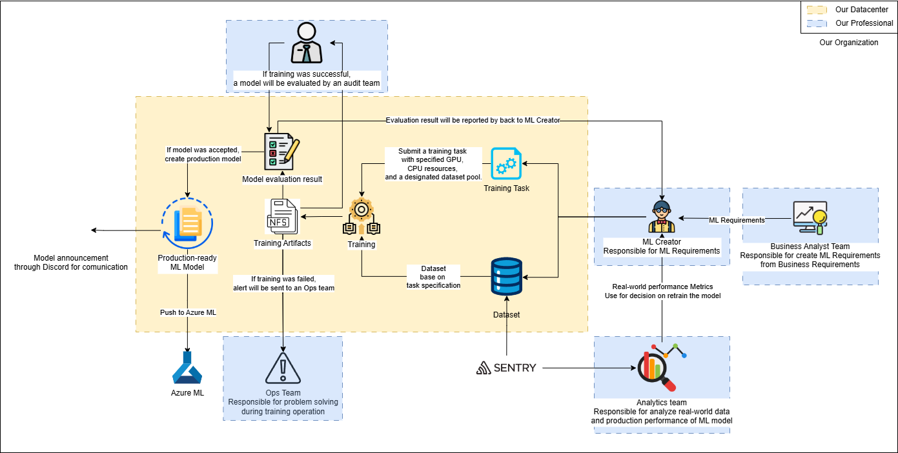

# ภาพรวมของ MLOps

<figure><figcaption></figcaption></figure>

### 🔹 **1. กระบวนการพัฒนาโมเดล Machine Learning**

#### **👨‍💼 ทีม BA (Business Analyst Team)** [business-analyst.md](business-analyst.md "mention")

* กำหนด **ข้อกำหนดด้าน ML (ML Requirements)** ตามความต้องการทางธุรกิจ
* ส่งข้อมูลไปยัง **ML Creator** เพื่อพัฒนาโมเดลให้ตรงกับวัตถุประสงค์

#### **👨‍💻 นักพัฒนาโมเดล ML (ML Creator)** [ml-creator.md](../ml-creator.md "mention")

* ออกแบบและกำหนดการฝึกโมเดลตาม **ML Requirements**
* ใช้ข้อมูลจาก **ทีมวิเคราะห์ข้อมูล (Analytics Team)** เพื่อตัดสินใจว่าควรฝึกโมเดลใหม่หรือไม่

***

### 🔹 **2. กระบวนการฝึกโมเดล (Model Training)**

#### **📂 การจัดการข้อมูล (Dataset & Training Task)**

* โมเดลใช้ **ชุดข้อมูลที่กำหนด** จากระบบ **Sentry**
* ส่งงานฝึกโมเดลไปยัง **เซิร์ฟเวอร์ที่กำหนด GPU, CPU และทรัพยากรข้อมูล**

#### **🖥️ การประมวลผลและจัดเก็บผลลัพธ์**

* ใช้ **SLURM Task Manager** เพื่อจัดการคิวงานฝึกบน **AMD MI-100**
* ไฟล์ที่เกี่ยวข้องกับการฝึกจะถูกเก็บไว้ในระบบ **NFS (Network File System)**

***

### 🔹 **3. กระบวนการตรวจสอบและอนุมัติ (Model Evaluation & Deployment)**

#### **📋 การประเมินผลโมเดล**  [audit.md](../audit.md "mention")

* หากโมเดลฝึกสำเร็จ **ทีมตรวจสอบ (Audit Team)** จะทำการประเมินผล
* ผลการประเมินจะส่งกลับไปยัง **ML Creator**

#### **🚀 การนำโมเดลไปใช้จริง (Deploy to Azure ML)**

* หากโมเดลผ่านการอนุมัติ → **Deploy แบบ Manual** ไปที่ **Azure ML**
* หากโมเดลล้มเหลวในการฝึก → ระบบ **แจ้งเตือนทีม Ops** ให้วิเคราะห์และแก้ปัญหา

***

### 🔹 **4. ระบบตรวจสอบและการปรับปรุงโมเดล (Monitoring & Feedback Loop)**

#### **🔍 ทีมวิเคราะห์ข้อมูล (Analytics Team)**  [data-analysts.md](../data-analysts.md "mention")

* วิเคราะห์ข้อมูล **ประสิทธิภาพของโมเดลในโลกจริง**
* ส่งต่อ **เมตริกประสิทธิภาพ** ให้ทีม ML เพื่อตัดสินใจว่าควรฝึกโมเดลใหม่หรือไม่

#### **⚠️ ทีมปฏิบัติการ (Ops Team)** [ops.md](../ops.md "mention")

* มีหน้าที่แก้ไข **ปัญหาการฝึกโมเดล** และ **Infrastructure Issues**
* ใช้**ระบบ Monitoring** เพื่อติดตามปัญหาในระหว่างการทำงาน

#### **💬 การแจ้งเตือนและประกาศ**

* เมื่อมี **การ Deploy โมเดลใหม่** ระบบจะทำการประกาศผ่าน **Discord**

***

## 🎯 **สรุปภาพรวม MLOps**

✅ กระบวนการพัฒนาโมเดล **มีการตรวจสอบจาก Business Analyst & Audit Team**\
✅ ใช้ **Datacenter ภายในองค์กร** พร้อม **TrueNAS SCALE + AMD MI-100**\
✅ การปรับใช้โมเดลเป็น **Manual Deployment บน Azure ML**\
✅ **ทีมวิเคราะห์และทีมปฏิบัติการ** ช่วยกันตรวจสอบประสิทธิภาพ และกำหนดว่าควรฝึกโมเดลใหม่เมื่อใด
