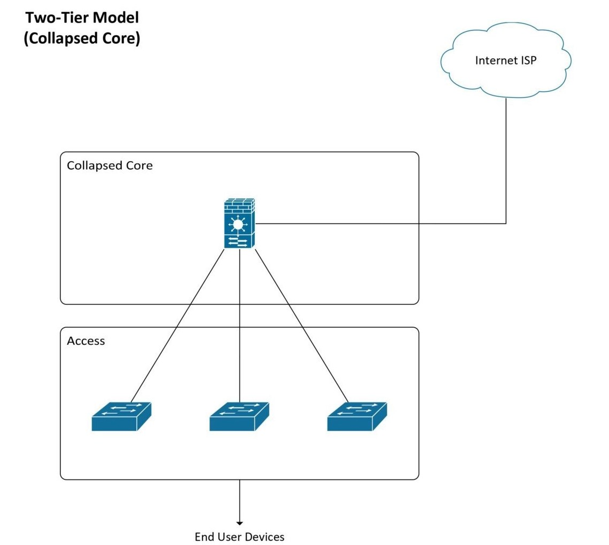

# Logical Topology

การออกแบบ Network ภายในบริษัทเราจะใช้การออกแบบอ้างอิงตาม Collapsed Core Architecture

<figure><figcaption></figcaption></figure>

Collapsed Core Architecture เป็นสถาปัตยกรรมเครือข่ายแบบรวมศูนย์ โดยมีโครงสร้างเครือข่ายภายในบริษัท 2 ชั้น คือ Collapsed Core Layer และ Access Layer ซึ่งเหมาะสำหรับเครือข่ายขนาดเล็กถึงปานกลางที่ไม่ต้องการโครงสร้างเครือข่ายที่ซับซ้อนเกินไป โดยมีข้อดีและข้อเสียดังนี้\

**ข้อดี**&#x20;

* โครงสร้างเครือข่ายมีความซับซ้อนน้อย ทำให้การตั้งค่า (Configuration) และการดูแลระบบได้ง่ายขึ้น
* ประสิทธิภาพที่ดีขึ้น เนื่องจากรวมชั้น Distribution Layer และชั้น Core Layer ไปด้วยกันทำให้การสื่อสารระหว่างอุปกรณ์ได้ง่ายขึ้น
* ลดต้นทุน เนื่องจากรวมชั้น Distribution Layer และชั้น Core Layer ทำให้อุปกรณ์ที่ต้องใช้ลดลง

**ข้อเสีย**

* หากอุปกรณ์ใน Collapsed Core Layer พังอาจทำให้ระบบได้รับผลกระทบทั้งหมดทั้ง network
* ความยืดหยุ่นในการปรับขยายเครือข่ายน้อยเนื่องจากมีเพียง 2 layer ต่างจาก Three-Tier Hierarchy Architecture ที่สามารถทำได้มากกว่า

โดยเราได้นำ Collapsed Core Architecture นำมาออกแบบ Network ภายในบริษัท และลดข้อเสียที่ Collapsed Core Layer โดยมีการทำ Redundancy ภายใน Layer หากเกิดว่าอุปกรณ์หนึ่งพังสามารถ routing ผ่านอีกหนึ่งตัวได้

ต่อไปนี้เป็น Logical Topology สำหรับทั้ง Headquarter และ Branch ของบริษัท

1. **Headquarter**

<figure><figcaption></figcaption></figure>

2. **Branch**

<figure><figcaption></figcaption></figure>

