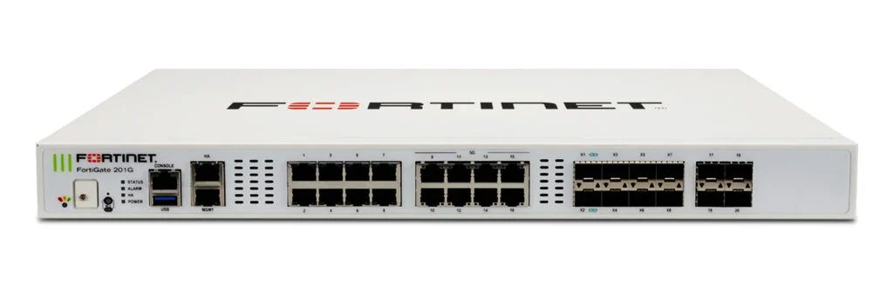

# Network Equipment

การเลือกอุปกรณ์ Network Equipment สำหรับองค์กรถือว่ามีความสำคัญสำหรับระบบ Network ในองค์กร การเลือกอุปกรณ์ที่เหมาะสม นอกจากที่จะทำให้การส่งข้อมูลภายในองค์กรเป็นไปได้อย่างราบรื่นและมีความปลอดภัย ยังทำให้มีความสามารถที่จะรองรับการขยายตัวของระบบ Network ภายในอนาคต โดยอุปกรณ์ Network ที่เราเลือกใช้ในองค์เรามีดังต่อไปนี้

## Huawei NetEngine 8000 F1A (Provider Edge Router)

<figure><figcaption></figcaption></figure>

**Forwarding performance:** 453Mpps

**Switching capacity:** 2.4T bit/s

**Interfaces:** 8x QSFP+ (40 Gb/s), 10x SFP+ (10 Gb/s), 28x SFP (1 Gb/s)

**Price:** 421,353 Baht

มี **Forwarding performance** และ **Switching capacity** ที่สูงเหมาะสำหรับองค์กรขนาดใหญ่ สามารถที่จะเชื่อมต่อ Interface **QSFP+** กับ ISP ได้ทำให้การส่งข้อมูลระหว่างบริษัทสามารถทำได้อย่างรวดเร็วมากขึ้น นอกจากนั้นยังมี Interface ที่จำนวนมากสามารถที่จะทำการขยายระบบ Network ในอนาคตได้ จึงเหมาะสมกับการนำมาใช้งานเป็น **Provider Edge Router** ของบริษัท

## **Fortinet FortiGate 600F** **(Firewall)**

<figure><figcaption></figcaption></figure>

**Firewall throughput (Packet per Second):** 105 Mpps

**Firewall latency (64 byte, UDP):** 4.12 μs / 2.5 μs\*

**Interfaces:** 8 x GE SFP Slots, 4 x 10GE/GE SFP+/SFP Slots, 4x 25GE/10GE SFP28/ SFP+

**Price:** 490,354 Baht

มี Firewall throughput ที่สูง นอกจากนั้นยังมี Firewall latency ที่ต่ำ ด้วยทั้งสองปัจจัยทำให้การตรวจสอบข้อมูล และ Traffic ต่างๆเกิดการ Delay ที่น้อย มี Next-Generation Firewall (NGFW) ซึ่งป้องกันภัยคุกคามแบบเรียลไทม์ ทั้ง Malware, Ransomware, Intrusion Prevention (IPS), และ DDoS และราคาของอุปกรณ์มีความเหมาะสม

## **Huawei S6720-30C-EI-24S-AC (Collapsed Core Layer Switch )**

<figure><figcaption></figcaption></figure>

**Forwarding performance:** 720 Mpps

**Switching capacity:** 2.56 Tbit/s

**Interfaces:** 24 x 10 GE SFP+, 2 x 40 GE QSFP+ ports

**Price:** 123,986 Baht

มี **Forwarding performance** และ **Switching capacity** ที่สูงมี interface **SFP+** ซึ่งสามารถนำไปต่อกับ Layer 2 Switch ที่รองรับทำให้ Network มีความรวดเร็วมากขึ้น นอกจากนั้นยังเป็น Layer 3 Switch ที่มีฟังก์ชันการทำงานครบรองรังทั้ง Static Routing และ Dynamic Routing รองรับการทำ VLAN ภายในบริษัท, MPLS และการทำ Redundancy Protocol ซึ่งภายในบริษัทต้องการทำ Redundancy เพื่อความมั่นคงของระบบ Network ภายใน

## **Huawei ekitEngine S220-48T4X** **(Access Switch)**

<figure><figcaption></figcaption></figure>

**Forwarding performance:** 131 Mpps

**Switching capacity:** 176 Gbps

**Interfaces:** 48x gigabit Ethernet 10/100/1000 Mb/s, 4x SFP+ (10 Gb/s)

**Price:** 18,404 Baht

เป็น Layer 2 Switch ที่มี Interface ที่มีความเร็วสูงและมีจำนวนพอร์ตมาก เหมาะสำหรับการต่อไปยังอุปกรณ์ต่างๆภายในองค์กร และราคามีความเหมาะสม

## **Arista DCS-7050CX3-32S-F (Data Center Switch)**

**Switching throughput:** 6.4 Terabits/sec

**Switching capacity:** 12.8 Tbps

**Interfaces:** 2x 10 Gigabit Ethernet SFP+, 32x 100 Gigabit Ethernet QSFP

**Price:** 136,271.67 Baht

เป็น **High-Performance Data Center Switch** ที่ออกแบบมาเพื่อตอบสนองความต้องการของ Cloud, Enterprise, และ High-Performance Computing (HPC), รองรับ Layer 2 และ Layer 3, รองรับ 100G Ethernet (32× QSFP28) ซึ่งเราจะใช้งานต่อกับ Data Center และยังออกแบบมาสำหรับ Data Center ด้วย Front-to-Back Airflow และ Low Power Consumption

## **Huawei AirEngine 5760-51 (Access Point)**

<figure><figcaption></figcaption></figure>

Wi-Fi 6 (802.11ax) standards

MU-MIMO

supports 160 MHz frequency bandwidth

support WEP, WPA/WPA2-PSK, WPA3-SAE, WPA/WPA2-PPSK,WPA/WPA2/WPA3-802.1x, and WAPI authentication/encryption modes

**Price:** 7,650.20 Baht

รองรับ Wi-Fi 6 (802.11ax) ความเร็วสูงสุด 5.95 Gbps, รองรับ OFDMA และ MU-MIMO ช่วยลด Latency และเพิ่มประสิทธิภาพเครือข่า&#xE22;**,** รองรับ WPA3, 802.1X และ WIDS/WIPS ป้องกันภัยคุกคามทางไซเบอร์, ประหยัดพลังงานด้วย Huawei Green AP Technology, สามารถใช้งานร่วมกับอุปกรณ์ Network ส่วนใหญ่ของบริษัทซึ่งเราเลือกใช้งานเป็นแบรนด์ Huawei และมีราคาที่เหมาะสม

## **Huawei AC6805 (WLAN Controller)**

<figure><figcaption></figcaption></figure>

**Direct Forwarding:** 120 Gbit/s

**Tunnel Forwarding:** 120 Gbit/s

**Maximum Number of Managed APs:** 10240

**Maximum Number of Access Users:** 102400

Radio Protocols 802.11 a/b/g/n/ac/ac Wave 2/ax/be

**Price:** 393,359.02 Baht

เป็น Wireless Access Controller (AC) ระดับองค์กรที่ออกแบบมาสำหรับ Large-Scale WLAN Deployment, รองรับ AP สูงสุด 10,240 ตัว และผู้ใช้ 100,000+ คน สามารถบริหารจัดการผ่าน Huawei iMaster NCE-Campus และ Cloud

## สรุป

โดยจำนวนอุปกรณ์ทั้งหมดที่ใช้งานในบริษัททั้งใน Headquarter และ Branch สามารถสรุปเป็นตารางได้ดังนี้

| **Type**              | **Name**                     | **Price (Baht)** | **Unit** |
| --------------------- | ---------------------------- | ---------------- | -------- |
| Provider Edge Router  | Huawei NetEngine 8000 F1A    | 421,353.23       | 2        |
| Firewall              | Fortinet FortiGate 600F      | 490,354          | 2        |
| Collapsed Core Switch | Huawei S6720-30C-EI-24S-AC   | 123,986.08       | 8        |
| Layer 2 Switch        | Huawei ekitEngine S220-48T4X | 18,404           | 13       |
| Lightweight AP        | Huawei AirEngine 5760-51     | 7,650.20         | 12       |
| WLAN Controller       | Huawei AC6805                | 393,359.02       | 2        |
| Data Center Switch    | Arista DCS-7050SX2-128-F     | 59,438.06        | 1        |

สรุปราคาสำหรับการติดตั้งระบบ Network Equipment ในบริษัทคือ **3,992,514.34 บาท**

## **Cable ที่ติดตั้งภายในบริษัท** 

1. **สายไฟเบอร์ออฟติก 1 Core มัวน 1000 เมตร**
   1. จำนวน 1 ม้วน ราคาต่อม้วน 1,750 บาท รวม 1,750 บาท
2. **LINK CAT6A 10GBE 305M US-9146LSZ**
   1. จำนวน 5 กล่อง ราคาต่อม้วน 9,074 บาท รวม 45,370 บาท
3. **Huawei 10G-1310nm-1.4km-SM-SFP+**
   1. จำนวน 60 ชิ้น ราคาต่อชิ้น 1,000 บาท ราคารวม 60,000 บาท
4. **HUAWEI 40GBASE-LR4 QSFP+ 1310NM 10KM**
   1. จำนวน 22 ชิ้น ราคาต่อชิ้น 14,000 บาท รวมราคา 308,000 บาท

สรุปราคาสำหรับ Cable ภายในบริษัทคือ **415,120 บาท (ราคายังไม่ได้รวมการติดตั้ง)**

