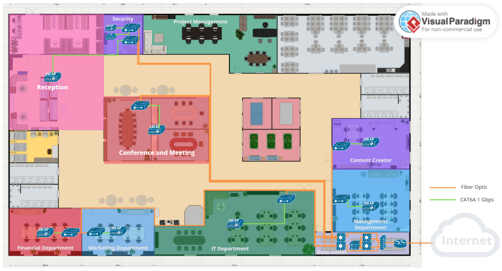
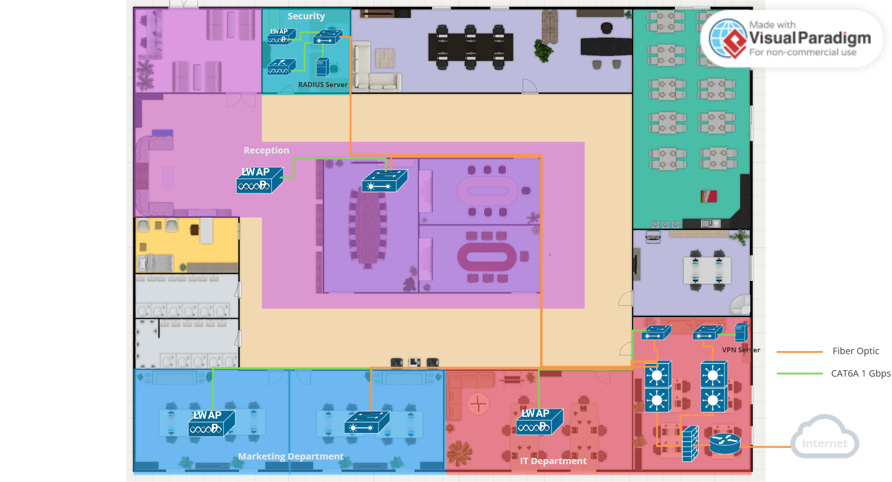

# Physical Topology

การออกแบบ **Physical Topology** ในองค์กรนี้เป็นไปตาม **Logical Topology** โดยมีการแบ่งโครงสร้างเครือข่ายออกเป็นชั้นต่างๆ ตามหลักการของ **Hierarchical Network Design** เพื่อให้มั่นใจว่าระบบเครือข่ายมีประสิทธิภาพ ความเสถียร และสามารถรองรับการขยายตัวในอนาคตได้

**การเชื่อมต่อภายในแต่ละแผนก**

* แต่ละแผนก (**Department**) มีการติดตั้ง **Access Point (AP)** เพื่อให้พนักงานสามารถเชื่อมต่อเครือข่ายผ่าน Wi-Fi ได้อย่างสะดวก
* คอมพิวเตอร์และอุปกรณ์ที่ต้องการการเชื่อมต่อแบบ **Wired Connection** จะถูกเชื่อมต่อผ่าน **Switch Layer 2** เพื่อให้สามารถรับ-ส่งข้อมูลได้อย่างมีเสถียรภาพ

**โครงสร้างสายสัญญาณและมาตรฐานที่ใช้**

* การเชื่อมต่อระหว่าง **Switch Layer 2 และ Access Point รวมถึงอุปกรณ์เครือข่ายอื่นๆ** จะใช้ **สายเคเบิลประเภท Cat6a** เพื่อรองรับความเร็วสูงสุด **10Gbps**
* การเชื่อมต่อระหว่าง **Switch Layer 2 และ Layer 3 Switch ใน Collapsed Core Layer** จะใช้ **Fiber Optic** เพื่อเพิ่มแบนด์วิดท์และลด Latency
* สำหรับการเชื่อมต่อระหว่าง **Collapsed Core Layer กับ Firewall และ Router** จะใช้ **Fiber Optic SFP+** ซึ่งสามารถรองรับอัตราการรับส่งข้อมูลสูง รองรับการส่งข้อมูลจากเครือข่ายภายในองค์กรไปยังอินเทอร์เน็ต และการรับข้อมูลจากภายนอกสู่เครือข่ายภายในได้อย่างมีประสิทธิภาพ
* การเชื่อมต่อระหว่าง **Router และระบบภายนอก** จะใช้ **QSFP+** ซึ่งรองรับความเร็วสูงที่ 40Gbps สำหรับการส่งข้อมูลปริมาณมาก

ต่อไปนี้เป็น Physical Topology สำหรับ Headquarter และ Branch ของบริษัท

## **Headquarter**

<figure><figcaption></figcaption></figure>

## **Branch**

<figure><figcaption></figcaption></figure>
