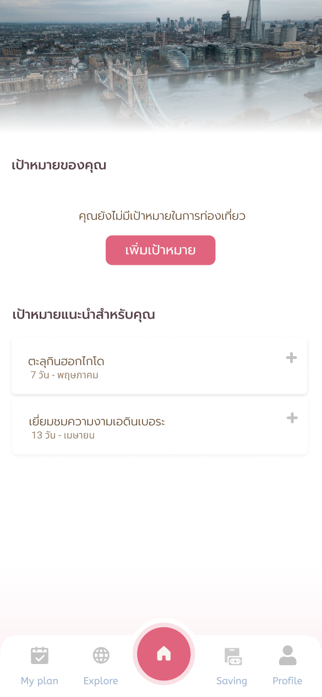

# User Flow

## Login & Register

<table data-header-hidden data-full-width="false"><thead><tr><th></th><th></th></tr></thead><tbody><tr><td></td><td></td></tr></tbody></table>

เมื่อเข้าใช้งานแอปพลิเคชันครั้งแรกผู้ใช้จำเป็นต้องทำการ "เข้าสู่ระบบ" ก่อน โดยการเข้าสู่ระบบผู้ใช้จำเป็นต้องมีบัญชีผู้ใช้ก่อน หากยังไม่มีสามารถสร้างบัญชีใหม่ได้โดยข้อมูลทั้งหมดจะถูกใช้เป็นข้อมูลส่วนหนึ่งของการสร้างแผนการท่องเที่ยวให้ผู้ใช้แบบอัตโนมัติ

## Home

<table data-header-hidden data-full-width="false"><thead><tr><th></th><th></th></tr></thead><tbody><tr><td></td><td></td></tr></tbody></table>

ในหน้า Home จะแสดงเป้าหมายการท่องเที่ยวของผู้ใช้ โดยผู้ใช้สามารถที่จะเพิ่มเป้าหมายได้จากเป้าหมายที่มีการแนะนำ หรือสามารถเพิ่มเป้าหมายใหม่ด้วยตัวเองได้

<table data-header-hidden data-full-width="false"><thead><tr><th></th><th></th><th></th><th></th></tr></thead><tbody><tr><td></td><td></td><td></td><td></td></tr></tbody></table>

โดยการเพิ่มเป้าหมายการท่องเที่ยว ผู้ใช้ต้องทำการเลือกประเทศที่จะไปพร้อมกับจำนวนวันและงบประมาณต่อคน รวมไปถึงไลฟ์สไตล์ในการท่องเที่ยว สถานที่ที่อยากไป และความสนใจโดยสามารถใส่ความสนใจได้ทั้งในรูปแบบของตัวหนังสือและวิดีโอจากเว็บไซต์ต่างๆ ซึ่งจะถูกใช้เป็นข้อมูลเริ่มต้นสำหรับการสร้างแผนขึ้นมาได้แบบอัตโนมัติ

## My Plan

หน้านี้จะทำการแสดงแผนการท่องเที่ยวที่มีทั้งหมดของผู้ใช้ในรูปแบบของปฏิทิน

<table data-header-hidden data-full-width="false"><thead><tr><th></th><th></th><th></th></tr></thead><tbody><tr><td></td><td></td><td></td></tr></tbody></table>

โดยผู้ใช้สามารถเพิ่มแผนใหม่เข้าไปได้โดยการเลือกเป้าหมายการท่องเที่ยวที่ต้องการ หลังจากนั้นเมื่อกด "วางแผน" ระบบจะทำการสร้างแผนต้นแบบให้ตามข้อมูลที่ผู้ใช้ระบุไว้ในเป้าหมาย และจะปรากฎขึ้นมาให้เห็นบนปฏิทิน

โดยที่ผู้ใช้งานสามารถเข้าไปดูและแก้ไขแผนได้โดยการกดไปที่วันที่หรือแผนที่ต้องการ

<table data-header-hidden data-full-width="false"><thead><tr><th></th><th></th><th></th><th></th></tr></thead><tbody><tr><td></td><td></td><td></td><td></td></tr></tbody></table>

โดยในแผนแต่ละแผนผู้ใช้สามารถที่จะทำการปรับเปลี่ยนช่วงเวลาของแต่ละสถานที่ และเพิ่มสถานที่ใหม่ๆ เข้าไปได้ ซึ่งในแต่ละการเปลี่ยนแปลงของผู้ใช้ ระบบจะทำการแนะนำการปรับแต่งแผนของผู้ใช้ให้มีประสิทธิภาพเพิ่มขึ้น (ประหยัดเวลาและลดค่าใช้จ่ายโดยรวม) ได้

นอกจากนี้ผู้ใช้ยังสามารถปรับแต่งวิธีการเดินทางระหว่างแต่ละสถานที่ได้ โดยที่ระบบจะช่วยกรองมาเฉพาะวิธีการเดินทางที่เป็นไปได้ และจัดเรียงลำดับตามความเหมาะสมกับผู้ใช้โดยเรียงลำดับจากความเหมาะสมที่มากที่สุดไปน้อยที่สุด เพื่อให้ผู้ใช้สามารถตัดสินใจเลือกวิธีการเดินทางได้ง่ายขึ้น

<table data-header-hidden data-full-width="false"><thead><tr><th></th><th></th></tr></thead><tbody><tr><td></td><td></td></tr></tbody></table>

และหลังจากที่ผู้ใช้วางแผนเสร็จเรียบร้อยแล้ว ผู้ใช้สามารถทำการดูค่าใช้จ่ายทั้งหมดที่ต้องชำระ และสิ่งที่ต้องเตรียมสำหรับการไปเที่ยวตามแผนนั้นๆ

<table data-header-hidden data-full-width="false"><thead><tr><th></th><th></th></tr></thead><tbody><tr><td></td><td></td></tr></tbody></table>

## Tracking

ในช่วงเวลาที่ผู้ใช้ไปเที่ยวจริง ระบบจะมีการแนะนำกิจกรรมที่ควรทำในสถานที่นั้้นๆ และหากการเที่ยวเริ่มไม่เป็นไปตามแผนระบบจะทำการปรับเปลี่ยนแผนให้เพื่อให้คุณสามารถเที่ยวต่อได้ อย่างต่อเนื่อง

<table data-header-hidden data-full-width="false"><thead><tr><th></th><th></th></tr></thead><tbody><tr><td></td><td></td></tr></tbody></table>

## Community

<figure><figcaption></figcaption></figure>

แอปพลิเคชันจะมีระบบ Community ที่ผู้ใช้สามารถมาค้นหา inspirations หรือแชร์ประสบการณ์ของตัวเองได้ โดยความสนใจของผู้ใช้ต่อ content ต่างๆ จะถูกนำมาประมวลผลเพื่อแนะนำเป้าหมายในการท่องเที่ยวใหม่ๆ อีกด้วย
